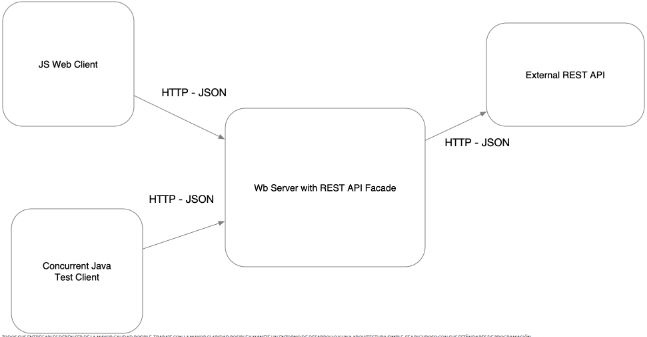

# TALLER 1: APLICACIONES DISTRIBUIDAS (HTTP, SOCKETS, HTML, JS,MAVEN, GIT)
Aplicación de consulta de descripciones de películas. Esta aplicación se conecta a un API externo para obtener las descripciones de películas. 
El usuario puede buscar una película por título y la aplicación mostrará una tabla con información sobre la película, como el género, la duración, la clasificación por edades y la sinopsis.

## Iniciando
Para descargar el repositorio y verlo local, utiliza el siguiente código:
```
  git clone https://github.com/YeSte114/AREP_LAB01.git
```
```
  cd AREP_LAB01
```
### Prerequisitos
Es necesario tener Java 8 y Maven instalados. Compruebe con los siguientes comandos:

```
java --version
mvn --version
```
### Instalación

Habilitar su IDE para correr el programa con maven, en este caso se usa NetBeans:


y darler run a la clase main de la clase HttpServer. Por otro lado tambien puede corre el proyecto con los siguientes comandos

```
mvn package
```

Y luego

```
mvn clean package exec:java -D "exec.mainClass"="edu.escuelaing.arep.app.AREP_LAB01.HttpServer"
```

Finalmente ingrese al navegador de su preferencia con el siguiente link:
http://localhost:35000

## Construcción

* [Maven](https://maven.apache.org/) - Manejo de dependencias
* [JavaScript](https://developer.mozilla.org/es/docs/Web/JavaScript) - Statics files (frontend)

## Autor

* **Yeison Steven Barreto Rodriguez** - *AREP - LAB01* - [YeSte114](https://github.com/YeSte114)


---

### DESCRIPCIÓN  DE LA ARQUITECTURA:



##### Requerimientos:

1) El cliente Web debe ser un cliente asíncrono que corra en el browser  y use Json como formato para los mensajes.
2) El servidor de servirá como un gateway para encapsular llamadas a otros servicios Web externos.
3) La aplicación debe ser multiusuario.
4) Todos los protocolos de comunicación serán sobre HTTP.
5) Los formatos de los mensajes de intercambio serán siempre JSON.
6) La interfaz gráfica del cliente debe ser los más limpia y agradableolo HTML y JS (Evite usar librerías complejas). Para invocar métodos REST desde el cliente usted puede utilizar la tecnología que desee.
7) Debe construir un cliente Java que permita probar las funciones del servidor fachada. El cliente utiliza simples conexiones http para conectarse a los servicios. Este cliente debe hacer pruebas de concurrencia en su servidor de backend.
8) La fachada de servicios tendrá un caché que permitirá que llamados que ya se han realizado a las implementaciones concretas con parámetros específicos no se realicen nuevamente. Puede almacenar el llamado como un String con su respectiva respuesta, y comparar el string respectivo. Recuerde que el caché es una simple estructura de datos.
9) Se debe poder extender fácilmente, por ejemplo, es fácil agregar nuevas funcionalidades, o es fácil cambiar el proveedor de una funcionalidad.
10) Debe utilizar maven para gestionar el ciclo de vida, git y github para almacenar al código fuente y heroku como plataforma de producción.
11) En el backend debe utilizar solo Java. No puede utilizar frameworks como SPRING.

## Documentación
Se encontrar la documentación en la carpeta nombrada "javadoc", para generar nueva documentación puede correr el siguiente comando
```
mvn javadoc:javadoc
```
La nueva documentación generada puede encontrarla en la ruta /target/site/apidocs

## Corriendo Tests unitatios

Para correr los test ubiquese en la carpeta principal de repositorio y corra el siguiente comando desde la consola

```
mvn test
```
## Explicaciones técnicas
La aplicación se basa en una arquitectura de API REST, que proporciona una interfaz uniforme para la comunicación con el API externo. Para lograr la extensibilidad, se utiliza el patrón de fachada. Este patrón proporciona una interfaz única para acceder a diferentes implementaciones de la API externa. Para cambiar la dirección de la URL de la API externa, simplemente se debe modificar el atributo url de la clase APIConnection.

- La modularización se logra aplicando los principios de única responsabilidad y separación de preocupaciones. Cada clase implementa solo una responsabilidad, lo que facilita la extensión del código.

- Patrones utilizados

  - Fachada: El patrón de fachada proporciona una interfaz única para acceder a diferentes implementaciones de la API externa. Esto facilita la extensibilidad y el mantenimiento del código.
  - Singleton: El patrón de singleton garantiza que solo exista una instancia de un objeto dado. Esto es importante en el caso del caché, ya que se debe garantizar que no haya conflictos en el acceso a los datos.
- Extensibilidad

  Para cambiar la dirección de la URL de la API externa, simplemente se debe modificar el atributo url de la clase APIConnection. Esto se puede hacer de forma programática o modificando el archivo de configuración de la aplicación.

- Modularización

  Todas las clases implementan métodos que cumplen el principio de única responsabilidad. Esto significa que cada clase solo tiene una responsabilidad, lo que facilita la extensión del código. Por ejemplo, la clase APIConnection solo se encarga de conectar con la API externa. La clase HttpServer solo se encarga de procesar los datos de la API externa y formatearlos en una tabla.
